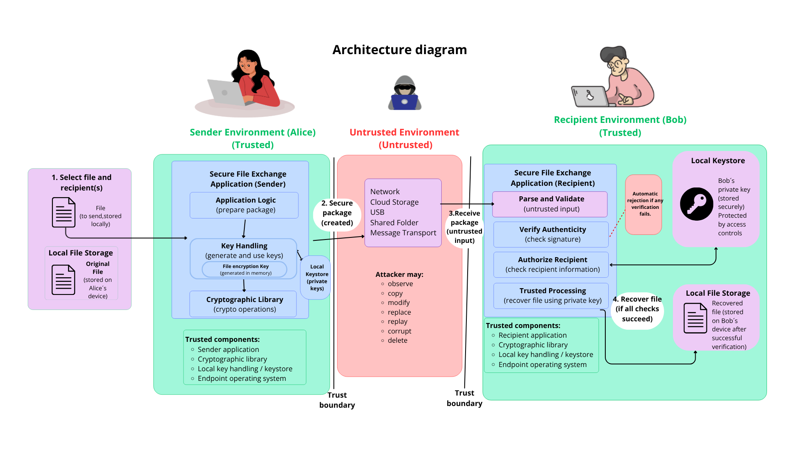

# Secure File Exchange Platform

## Secure Digital Document Vault

### D1 — Understand Security

*Architecture, Trust Boundaries and Security Mapping*

*Course:* Cryptography  
*Professor:* Dra. Rocío Aldeco  
*Team:* Team 03  

*Team members:*
- Castro Delgado Daniela Beatriz - 319039414
- González Frías Ana Paula - 319285099 
- Hernández Rubio Dana Valeria - 317345153
- Murillo Rodríguez Sarah Sofia - 422130448
- Roque Ruiz Bruno Ezequiel - 318276588

*Date:* 26/09/2026

# 1. System Overview
## 1.1 What problem does the system solve?

The Secure File Exchange Platform (Secure Digital Document Vault) solves the problem of securely exchanging files between a sender (Alice) and one or more authorized recipients (Bob, Carol, etc.) over a channel or storage medium that is not trusted (public network, cloud, USB drive, shared folder, etc.).

The system assumes that the intermediate channel/storage can be observed, copied, modified, replaced, or tampered with by an attacker. Therefore, the file must be protected before it leaves the sender's environment and verified before it is accepted by the recipient.

## 1.2 Core features

- Encryption of the file content (AEAD) before it leaves the sender's trusted environment.
- Generation of a file key and individual protection of that key for each authorized recipient (hybrid encryption).
- Packaging of the encrypted file together with control metadata (recipient, version, timestamp, etc.).
- Digital signature of the package to guarantee sender authenticity.
- Signature and integrity verification on the recipient side before processing the package (fail-closed).
- Decryption and recovery of the original file only if all verifications succeed.
- Support for multiple authorized recipients per file.
- Local storage of private keys (keystore) on both ends.

## 1.3 What is explicitly out of scope (D1 stage)

- The choice of specific cryptographic algorithm (AEAD, hybrid scheme, signature, KDF) — to be defined in D2, D3, D5 and D6.
- Protection against a malicious sender: Alice is assumed to act in good faith.
- Compromise of the local endpoint/device (malware, physical access): out of scope for this project.
- Large-scale key management infrastructure (full PKI).
- Availability guarantees for the transfer channel (resilience against DoS).
- User interface / user experience design.

# 2. Architecture Diagram and Trust Boundaries
The diagram below shows the overall architecture of the system, identifying trusted components, untrusted components, trust boundaries, and the main data flows for the Alice → untrusted environment → Bob scenario.

**Trust boundary 1:** exit from Alice's zone.  
**Trust boundary 2:** entry into Bob/Carol's zone.

## 2.1 Component classification

| Category | Elements |
|---|---|
| **Trusted components** | Alice's original file; Alice's private signing key; protection module (AEAD encryption + packaging + signature); file key generation; recipients' public keys (used as input); signature/integrity verification at Bob's side; Bob's private key; file key recovery; AEAD decryption and verification; recovered file; fail-closed logic. |
| **Untrusted components / data** | The secure package once it leaves Alice's environment; the transfer channel or storage medium (network, disk, cloud, USB); the package as received by Bob (treated as untrusted input until verified). |
| **Trust boundaries** | Boundary 1: border between Alice's trusted zone and the untrusted environment. Boundary 2: border between the untrusted environment and Bob/Carol's trusted zone. |
| **External actors** | Alice (sender); Bob and Carol (authorized recipients); active/passive attacker able to observe, copy, modify, replace, replay, or corrupt the package. |

## 2.2 Where each cryptographic operation happens

- **Encryption:** inside the protection module, within Alice's trusted zone, before Boundary 1.
- **Signing:** also inside Alice's protection module, using her private key, before leaving her zone.
- **Signature/integrity verification:** in Bob's zone, immediately upon receiving the package (fail-closed if it fails).
- **Key storage:** private keys remain in local keystores; they never cross trust boundaries in plaintext.

## 2.3 Main data flows

1. File + Alice's private key → protection module.
2. Protection module → secure package generated (encrypted + signed).
3. The package crosses Boundary 1 toward the untrusted channel/storage.
4. The package crosses Boundary 2 and reaches Bob/Carol's environment.
5. Signature/integrity verification and file key recovery.
6. AEAD decryption and verification.
7. Recovery of the original file, or a secure rejection (fail-closed) if any verification fails.

# 3. Security Requirements
The following security requirements the system must guarantee are listed below, written as verifiable properties:

1. **Confidentiality of file content.**  
   An attacker who obtains the encrypted package from the untrusted channel must not be able to learn the file content without possessing the correct private key of an authorized recipient.

2. **Confidentiality of the file key.**  
   An attacker who intercepts the package must not be able to recover the key protecting the file without the legitimate recipient's private key.

3. **Integrity of file content.**  
   Any unauthorized modification of the encrypted content must be detectable by the recipient before the file is recovered or used.

4. **Authenticity of the sender.**  
   The recipient must be able to verify, through cryptographic evidence, that the package was actually generated by the sender it claims to come from.

5. **Integrity of metadata.**  
   Any unauthorized alteration of control metadata must be detected before it is trusted or used.

6. **Confidentiality of private keys.**  
   Alice's and Bob's private keys must remain protected even if the local storage where they reside is compromised (never stored in plaintext).

7. **Protection against package tampering.**  
   A package that has been modified or corrupted in transit must be securely rejected (fail-closed), without exposing its content.

8. **Access restricted to authorized recipients.**  
   Only the recipients explicitly designated by the sender at protection time will be able to recover the original file.

9. **Replay resistance.**  
   The system must be able to identify or handle a previously valid package that is resent by an attacker, according to the defined replay policy.

10. **No information disclosure on failure.**  
    When a verification fails, the system must not leak internal information that could help an attacker refine an attack.

# 4. Threat Model

## 4.1 Assets to protect

- File content.
- File key / file recovery material.
- Package metadata (name, timestamp, recipient identifier, version).
- Private keys (Alice's and Bob's).
- User credentials (keystore passwords).
- Validity of the digital signature / sender identity.
- List of authorized recipients.

## 4.2 Adversaries

- External attacker with access to the channel/storage.
- Malicious recipient attempting to use the system outside authorized boundaries.
- Attacker modifying metadata to alter the system's behavior.
- Attacker with temporary access to the device (physical or remote).

## 4.3 What the attacker can do

- Passive observation (eavesdropping) of all traffic/storage in the untrusted channel.
- Active modification of bits, blocks, or metadata in the package.
- Replacement/injection: substituting a legitimate package, injecting malformed packages, or replacing a public key.
- Replay of a previously valid package.
- Suppression/deletion of packages, affecting availability.
- Attempting to get the system to accept a fake public key (without physical access to the keystore).

## 4.4 What the attacker cannot do

- No execution or physical access to Alice's or Bob's local OS/hardware.
- Not assumed capable of breaking the underlying cryptographic primitives.

## 4.5 Mapping: Asset → Threat → Attack Scenario → Security Requirement → Design Constraint

| Asset | Threat | Attack scenario | Security requirement | Design constraint |
|---|---|---|---|---|
| *File content* | Disclosure | The attacker obtains the package from the channel and tries to read the content. | Only authorized recipients can access the content. | The file must be encrypted before leaving the trusted environment. |
| *File key* | Disclosure | The attacker intercepts the package and tries to obtain the key protecting the file. | Only authorized recipients can recover the key. | The file key must be individually protected per recipient. |
| *Package metadata* | Modification / Tampering | The attacker alters metadata in transit or storage. | Any unauthorized modification must be detected. | Metadata must be authenticated together with the content. |
| *Sender identity* | Spoofing | The attacker builds or modifies a package presenting it as coming from Alice. | The recipient must verify the real authenticity of the sender. | The package must include verifiable authenticity evidence. |
| *Package / channel* | Replay | The attacker resends an old, previously valid copy of the package. | The system must identify or discard repeated packages. | The package must include information that distinguishes each specific send. |
| *Private keys* | Theft or compromise | The attacker accesses local storage and tries to extract the private key. | Private keys must remain protected even if local storage is compromised. | Private keys must not be stored in plaintext. |
| *Complete secure package* | Manipulation / corruption | The attacker corrupts the package and the recipient processes it unaware. | Manipulated packages must be rejected (fail-closed). | The system must validate integrity before exposing the content. |
| *List of recipients* | Unauthorized access | A non-selected user attempts to recover the file. | Only designated recipients will be able to recover the file. | Recipient selection is fixed at protection time. |
| *User credentials* | Interception / sniffing | The attacker captures plaintext traffic during login. | Credentials must be protected in transit and at rest. | Use of encrypted protocols/storage, never plaintext. |

# 5. Trust Assumptions

## 5.1 Alice's zone (sender)
| Component | Trust level | Security assumption (justification) |
|---|---|---|
| **Alice (external actor)** | Trusted | Assumed to act in good faith and to only send to recipients of her choosing. The design does not protect against a malicious sender. |
| **Original file (plaintext)** | Partially trusted | Assumed valid before entering the protection module; its future confidentiality depends entirely on encryption being applied correctly. |
| **Alice's private key (signature)** | Trusted | Assumed that Alice's device adequately protects it. If this fails, an attacker could sign forged packages impersonating Alice. |
| **Protection module (AEAD + signature)** | Trusted | Assumed to be correctly implemented (correct primitives, unique nonces) and not modified by an attacker. |
| **File key generation** | Trusted | A cryptographically secure random number generator (CSPRNG) is assumed. If weak, the system's entire confidentiality would collapse. |
| **Recipients' public keys** | Partially trusted | Obtained from a channel external to the diagram; assumed to have been obtained authentically (verified out-of-band). If this fails, a MITM attack on key registration occurs. |
| **Secure package generated** | Trusted → Untrusted once crossing Boundary 1 | Its protection (encryption + signature) is the only thing upholding trust once it leaves the controlled environment. |

## 5.2 Untrusted zone (transfer / storage)
| Component | Trust level | Security assumption (justification) |
|---|---|---|
| **Transfer/storage channel** | Untrusted | By design, the attacker is assumed to have full control: observe, copy, modify, replace, replay, or delete the package. |
| **Attacker (active/passive)** | Adversary | Full access to the channel/storage is assumed, but not to Alice's or Bob's trust zones. |

## 5.3 Bob/Carol's zone (recipients)
| Component | Trust level | Security assumption (justification) |
|---|---|---|
| **Package received** | Untrusted until verified | Even if it arrives encrypted and signed, it is treated as hostile input until signature and integrity are validated. |
| **Signature/integrity verification** | Trusted | Assumed that this code is correct and has not been tampered with; it acts as the gatekeeper for the rest of the process. |
| **Bob's private key** | Trusted | Protected on his device, with no third-party access. |
| **File key recovery** | Trusted | Depends on Bob's private key being intact and the package having already passed verification. |
| **AEAD decryption and verification** | Trusted | Assumed to correctly detect any tampering with the ciphertext and to fail securely if authentication fails. |
| **Recovered original file** | Trusted (conditioned) | Trusted only if all preliminary checks were successful. |
| **Fail-closed** | Trusted | Assumed that this logic does not reveal sensitive information upon failure and correctly blocks unverified data. |

## 5.4 Cross-cutting assumption (outside the diagram, but critical)
| Component | Trust level | Security assumption (justification) |
|---|---|---|
| **Alice's and Bob's local environment (OS/hardware)** | Trusted, with an explicit caveat | Assumed that no local device is compromised. If the local machine were compromised, no cryptographic protection could prevent the private key or plaintext file from being leaked. |

# 6. Attack Surface Review
## 6. Attack Surface Review

The attack surface is organized according to the system's two trust boundaries.

### 6.1 Boundary 1 — Alice's environment → Untrusted channel

| Interface / component | What could go wrong? | Security property at risk |
| :--- | :--- | :--- |
| Secure package generated (output) | It is the only exposed surface when leaving the trusted environment; its cryptographic protection is the only thing preventing an observer from extracting information. | Confidentiality, integrity |
| Recipient public key import interface | If the public key is obtained via an unverified channel, an attacker can substitute it before encryption (MITM). | Confidentiality of content |
| Password entry | If the password unlocking Alice's keystore is captured (keylogging, unmasked field), the private key is compromised. | Confidentiality of private keys |
| CLI arguments | Paths, passwords, or keys passed as parameters may be exposed in shell history or process logs. | Confidentiality of credentials and keys |

### 6.2 Boundary 2 — Untrusted channel → Bob/Carol's environment

| Interface / component | What could go wrong? | Security property at risk |
| :--- | :--- | :--- |
| Secure package parser | Malformed fields, out-of-range sizes, unexpected data types, or unsupported algorithm versions. | Availability, integrity |
| Recovered file input | Malicious filenames or path traversal when writing the decrypted file to disk. | File system integrity |
| Control metadata | Recipient identifiers, algorithm ID, version, and timestamps modifiable prior to verification. | Integrity, authenticity |
| Key interfaces / local keystore | Access to Bob's keystore and password/PIN request to unlock his private key. | Confidentiality of private keys |
| Transport / buffer channel | Reading, modification, replacement, replay, or deletion of packets in transit or at rest. | Confidentiality, integrity, availability |
| Error handling and logging | Error messages or logs that could leak internal information without a generic fail-closed scheme. | Confidentiality of internal information |
| Password entry at Bob's side | Same as Alice: capturing the password compromises the private key. | Confidentiality of private keys |
| Signature verification | Implementation errors could accept invalid or forged signatures. | Authenticity |

### 6.3 Realistic attacker capabilities (summary)

* Passive observation: can read and copy all traffic/storage in the untrusted channel.
* Active modification: can alter packet bits/blocks and metadata.
* Replacement/injection: can substitute a legitimate package, inject malformed packages, or replace a public key.
* Replay: can capture a valid package and resend it later.
* Suppression/deletion: can block or delete packages, affecting availability.
* Out of scope: no physical/execution access to local devices, and no ability to break underlying cryptographic primitives.

# 7. Unresolved Security Questions
The following cryptographic design decisions are intentionally left open at this stage:

* Which AEAD algorithm will be used (AES-GCM vs. ChaCha20-Poly1305) and with what key size?
* Which hybrid encryption scheme will protect the file key per recipient (RSA-OAEP, ECIES, or other)?
* Which digital signature algorithm will be used (RSA-PSS, ECDSA, EdDSA) and exactly which fields will be signed?
* How will nonces/IVs be generated and managed, avoiding reuse?
* What serialization/canonicalization format will be used for metadata before signing?
* What KDF and parameters will protect private keys at rest (encrypted keystore)?
* What mechanism will detect/mitigate replay attacks (timestamps, nonces, counters)?
* How will the key lifecycle be managed (generation, identification, rotation, revocation)?
* What minimal error information will be exposed without leaking details useful to an attacker?

